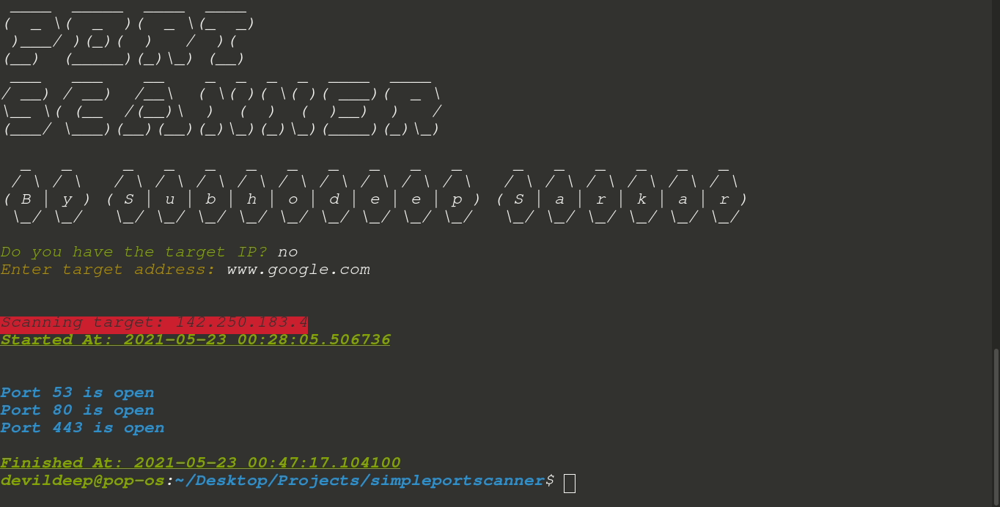

# **Simple Port Scanner**
## *By Subhodeep Sarkar*
*A simple port scanner with minimalist VFX!*

### How to start?
1. Run "pip3 install -r requirements.txt".
2. Run "python3 main.py"
3. Enjoy ;)

### How to use?

